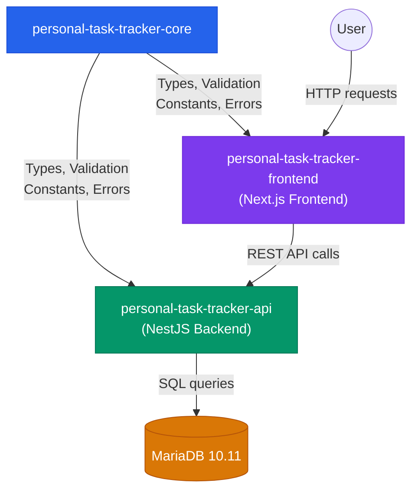

# Personal Task Tracker — Core


> Shared TypeScript package containing types, validation logic, constants, and error handling used by both the **API** and **Frontend** of the Personal Task Tracker project.

---

## Table of Contents

- [What This Package Does](#what-this-package-does)
- [Installation](#installation)
- [Quick Start](#quick-start)
- [API Reference](#api-reference)
 - [Types](#types)
 - [Constants](#constants)
 - [Validation Functions](#validation-functions)
 - [Error System](#error-system)
- [Testing](#testing)
- [Development](#development)
- [Architecture](#architecture)
- [Contributing](#contributing)

---

## What This Package Does

In this project, the **API** (NestJS backend) and the **Frontend** (Next.js) both need to agree on things like:

- What does a **Task** look like? (its shape/fields)
- What **statuses** can a task have? (`TODO`, `IN_PROGRESS`, `DONE`)
- How long can a **title** or **description** be?
- How do we **validate** user input consistently?
- How do we format **errors** so the frontend can display them?

Instead of duplicating this logic in two places (and risking them getting out of sync), we put it all in this **shared Core package**. Both the API and Frontend install it as a local dependency and import what they need.

**Think of it like a rulebook that both the server and the client follow.**

---

## Installation

This package lives alongside the API and Frontend as a sibling directory. Install it from the parent project:

```bash
# Run this from your API or Frontend project directory
npm install personal-task-tracker-core@file:../personal-task-tracker-core
```

This creates a symlink in `node_modules/` pointing to the Core package. Any changes you make to Core are immediately available — no need to reinstall.

> **Docker note:** During Docker builds, the Core is copied into the build context and the symlink is replaced with a real copy.

---

## Quick Start

Here's a complete example showing how to import and use the most common exports:

```typescript
import {
 // Types
 Task,
 CreateTaskDTO,
 TaskStatus,
 // Validation
 validateCreateTask,
 isValidTaskStatus,
 // Constants
 TASK_TITLE_MAX_LENGTH,
 // Errors
 ErrorCode,
 getErrorMessage,
 isApiErrorResponse,
} from 'personal-task-tracker-core';

// 1. Create a task DTO and validate it
const newTask: CreateTaskDTO = {
 title: 'Buy groceries',
 description: 'Milk, eggs, and bread',
};

const result = validateCreateTask(newTask);

if (result.valid) {
 console.log(' Task is valid! Send it to the API.');
} else {
 console.log(' Validation errors:');
 result.errors.forEach((err) => {
 console.log(` - [${err.code}] ${err.message}`);
 });
}

// 2. Check if a status string is valid
if (isValidTaskStatus('IN_PROGRESS')) {
 console.log('That is a valid status!');
}

// 3. Get a user-friendly error message
const msg = getErrorMessage(ErrorCode.TITLE_REQUIRED);
// → "Every task needs a title. Please add one."
```

---

## API Reference

Everything is exported from the package entry point — you can import anything directly:

```typescript
import { Task, TaskStatus, validateCreateTask /* ... */ } from 'personal-task-tracker-core';
```

### Types

#### `Task`

The main task model. Represents a task as stored in the database.

```typescript
interface Task {
 id: number;
 title: string;
 description: string | null;
 status: TaskStatus;
 created_at: Date;
}
```

**Example:**

```typescript
const task: Task = {
 id: 1,
 title: 'Learn TypeScript',
 description: 'Complete the official tutorial',
 status: TaskStatus.IN_PROGRESS,
 created_at: new Date('2025-01-15'),
};
```

---

#### `CreateTaskDTO`

Data Transfer Object for creating a new task. Only `title` is required.

```typescript
interface CreateTaskDTO {
 title: string;
 description?: string | null;
}
```

**Example:**

```typescript
// Minimal — just a title
const minimal: CreateTaskDTO = { title: 'Buy groceries' };

// With description
const detailed: CreateTaskDTO = {
 title: 'Buy groceries',
 description: 'Milk, eggs, bread, and butter',
};
```

---

#### `UpdateTaskDTO`

Data Transfer Object for updating an existing task. All fields are optional — only include what you want to change.

```typescript
interface UpdateTaskDTO {
 title?: string;
 description?: string | null;
 status?: TaskStatus;
}
```

**Example:**

```typescript
// Update just the status
const markDone: UpdateTaskDTO = { status: TaskStatus.DONE };

// Update title and clear description
const rename: UpdateTaskDTO = {
 title: 'Updated task name',
 description: null,
};
```

---

### Constants

#### `TaskStatus` (enum)

The three possible states a task can be in:

```typescript
enum TaskStatus {
 TODO = 'TODO',
 IN_PROGRESS = 'IN_PROGRESS',
 DONE = 'DONE',
}
```

**Example:**

```typescript
import { TaskStatus } from 'personal-task-tracker-core';

const status = TaskStatus.TODO; // "TODO"
const wip = TaskStatus.IN_PROGRESS; // "IN_PROGRESS"
const done = TaskStatus.DONE; // "DONE"

// Loop through all statuses
Object.values(TaskStatus).forEach((s) => console.log(s));
// → "TODO", "IN_PROGRESS", "DONE"
```

---

---

#### Field Length Limits

Constants that define maximum (and minimum) lengths for task fields. Used by the validation functions and useful for frontend form validation.

| Constant | Value | Description |
| ------------------------------ | ------ | ------------------------------ |
| `TASK_TITLE_MIN_LENGTH` | `1` | Title must have at least 1 char |
| `TASK_TITLE_MAX_LENGTH` | `255` | Title cannot exceed 255 chars |
| `TASK_DESCRIPTION_MAX_LENGTH` | `1000` | Description cannot exceed 1000 chars |

**Example:**

```typescript
import {
 TASK_TITLE_MAX_LENGTH,
 TASK_DESCRIPTION_MAX_LENGTH,
} from 'personal-task-tracker-core';

// Use in a frontend form
<input maxLength={TASK_TITLE_MAX_LENGTH} />
<textarea maxLength={TASK_DESCRIPTION_MAX_LENGTH} />

// Use in a character counter
const remaining = TASK_TITLE_MAX_LENGTH - title.length;
console.log(`${remaining} characters left`);
```

---

### Validation Functions

All validators return a `ValidationResult` object:

```typescript
interface ValidationResult {
 valid: boolean; // true if no errors
 errors: AppError[]; // array of error objects (empty if valid)
}
```

Each `AppError` in the `errors` array has this shape:

```typescript
interface AppError {
 code: ErrorCode; // machine-readable error code
 message: string; // human-friendly error message
 field?: string; // which field caused the error (e.g., "title")
}
```

---

#### `validateCreateTask(dto: CreateTaskDTO): ValidationResult`

Validates input for creating a new task.

**What it checks:**
- Title is present and not empty (after trimming)
- Title does not exceed 255 characters
- Description (if provided) does not exceed 1,000 characters

**Example — valid input:**

```typescript
import { validateCreateTask } from 'personal-task-tracker-core';

const result = validateCreateTask({ title: 'Buy groceries' });

console.log(result);
// {
// valid: true,
// errors: []
// }
```

**Example — invalid input (multiple errors):**

```typescript
const result = validateCreateTask({
 title: '',
 description: 'a'.repeat(1001),
});

console.log(result);
// {
// valid: false,
// errors: [
// {
// code: 'TITLE_REQUIRED',
// message: 'Every task needs a title. Please add one.',
// field: 'title'
// },
// {
// code: 'DESCRIPTION_TOO_LONG',
// message: 'Your description is too long. Please keep it under 1000 characters.',
// field: 'description'
// }
// ]
// }
```

---

#### `validateUpdateTask(dto: UpdateTaskDTO): ValidationResult`

Validates input for updating an existing task. Only validates fields that are provided.

**What it checks:**
- If `title` is provided: must not be empty, must not exceed 255 characters
- If `description` is provided and not `null`: must not exceed 1,000 characters
- If `status` is provided: must be a valid `TaskStatus` value

**Example — valid status change:**

```typescript
import { validateUpdateTask, TaskStatus } from 'personal-task-tracker-core';

const result = validateUpdateTask({ status: TaskStatus.DONE });
console.log(result.valid); // true
```

**Example — invalid status:**

```typescript
const result = validateUpdateTask({ status: 'INVALID' as any });

console.log(result);
// {
// valid: false,
// errors: [
// {
// code: 'INVALID_STATUS',
// message: "That status doesn't exist. Please use To Do, In Progress, or Done.",
// field: 'status'
// }
// ]
// }
```

**Example — empty DTO is valid** (no changes requested):

```typescript
const result = validateUpdateTask({});
console.log(result.valid); // true
```

---

#### `isValidTaskStatus(status: string): status is TaskStatus`

A [type guard](https://www.typescriptlang.org/docs/handbook/2/narrowing.html#using-type-predicates) that checks if a string is a valid `TaskStatus`. Useful when you receive a status from user input or an API response and need to verify it.

**Example:**

```typescript
import { isValidTaskStatus, TaskStatus } from 'personal-task-tracker-core';

const userInput = 'IN_PROGRESS';

if (isValidTaskStatus(userInput)) {
 // TypeScript now knows `userInput` is TaskStatus
 console.log('Valid status:', userInput);
} else {
 console.log('Invalid status');
}

// Quick checks
isValidTaskStatus('TODO'); // true
isValidTaskStatus('DONE'); // true
isValidTaskStatus('PENDING'); // false
isValidTaskStatus(''); // false
```

---

### Error System

The error system provides a consistent way to create, identify, and display errors across the entire application.

#### `ErrorCode` (enum)

Machine-readable error codes, grouped by category:

| Code | Category | When it's used |
| ---------------------- | ---------- | ------------------------------------------------- |
| `VALIDATION_FAILED` | Validation | General validation failure |
| `TITLE_REQUIRED` | Validation | Task title is missing or empty |
| `TITLE_TOO_LONG` | Validation | Title exceeds 255 characters |
| `DESCRIPTION_TOO_LONG` | Validation | Description exceeds 1,000 characters |
| `INVALID_STATUS` | Validation | Status is not `TODO`, `IN_PROGRESS`, or `DONE` |
| `UNKNOWN_FIELDS` | Validation | Request contains unrecognized fields |
| `TASK_NOT_FOUND` | Resource | Requested task doesn't exist |
| `DATABASE_ERROR` | Server | Database operation failed |
| `INTERNAL_ERROR` | Server | Unexpected server error |
| `RATE_LIMIT_EXCEEDED` | Server | Too many requests in a short time |
| `SERVICE_UNAVAILABLE` | Server | Server is down or unreachable |

**Example:**

```typescript
import { ErrorCode } from 'personal-task-tracker-core';

if (error.code === ErrorCode.TASK_NOT_FOUND) {
 console.log('Task was not found!');
}
```

---

#### `ERROR_MESSAGES`

A map from every `ErrorCode` to a **user-friendly, human-readable** message. These messages avoid technical jargon and are safe to display directly in a UI.

```typescript
import { ERROR_MESSAGES, ErrorCode } from 'personal-task-tracker-core';

console.log(ERROR_MESSAGES[ErrorCode.TITLE_REQUIRED]);
// → "Every task needs a title. Please add one."

console.log(ERROR_MESSAGES[ErrorCode.RATE_LIMIT_EXCEEDED]);
// → "You're making requests too quickly. Please wait a moment and try again."
```

---

#### `AppError` (interface)

The standard error object used throughout the app:

```typescript
interface AppError {
 code: ErrorCode; // machine-readable code for programmatic handling
 message: string; // human-friendly message for display
 field?: string; // optional — which field caused the error
}
```

---

#### `ApiErrorResponse` (interface)

The standard shape for error responses returned by the API:

```typescript
interface ApiErrorResponse {
 success: false; // always false for errors
 statusCode: number; // HTTP status code (400, 404, 500, etc.)
 error: string; // HTTP error name ("Bad Request", "Not Found", etc.)
 message: string; // summary message
 errors?: AppError[]; // optional array of detailed errors
 timestamp: string; // ISO 8601 timestamp
 path?: string; // the API endpoint that was called
}
```

---

#### `createAppError(code, field?, customMessage?): AppError`

Factory function to create a consistent `AppError` object.

```typescript
import { createAppError, ErrorCode } from 'personal-task-tracker-core';

// Basic — uses the default message from ERROR_MESSAGES
const err1 = createAppError(ErrorCode.TITLE_REQUIRED);
// { code: 'TITLE_REQUIRED', message: 'Every task needs a title. Please add one.' }

// With a field name
const err2 = createAppError(ErrorCode.TITLE_REQUIRED, 'title');
// { code: 'TITLE_REQUIRED', message: 'Every task needs a title. Please add one.', field: 'title' }

// With a custom message
const err3 = createAppError(ErrorCode.VALIDATION_FAILED, undefined, 'Something custom went wrong');
// { code: 'VALIDATION_FAILED', message: 'Something custom went wrong' }
```

---

#### `getErrorMessage(code: ErrorCode): string`

Retrieves the user-friendly message for a given error code.

```typescript
import { getErrorMessage, ErrorCode } from 'personal-task-tracker-core';

const msg = getErrorMessage(ErrorCode.TASK_NOT_FOUND);
// → "We couldn't find that task. It may have been deleted."
```

---

#### `isApiErrorResponse(data: unknown): data is ApiErrorResponse`

A [type guard](https://www.typescriptlang.org/docs/handbook/2/narrowing.html#using-type-predicates) that checks if an unknown value is an `ApiErrorResponse`. Especially useful in the frontend when handling API responses.

```typescript
import { isApiErrorResponse } from 'personal-task-tracker-core';

const response = await fetch('/tasks');
const data = await response.json();

if (isApiErrorResponse(data)) {
 // TypeScript knows `data` is ApiErrorResponse
 console.error(`Error ${data.statusCode}: ${data.message}`);

 // Show field-level errors if available
 data.errors?.forEach((err) => {
 console.error(` [${err.field}] ${err.message}`);
 });
} else {
 // Handle success
 console.log('Tasks:', data.data);
}
```

---

## Testing

The package has **41 tests** covering all modules. Tests are written with [Jest](https://jestjs.io/) and [ts-jest](https://kulshekhar.github.io/ts-jest/).

### Run all tests

```bash
npm test
```

### Run tests in watch mode

Automatically re-runs tests when you save a file — great for development:

```bash
npm run test:watch
```

### Run tests with coverage report

```bash
npm run test:cov
```

### What's tested

| Test file | Tests | What it covers |
| --------------------------- | ----- | ------------------------------------------------------ |
| `tests/errors.test.ts` | 20 | ErrorCode enum, ERROR_MESSAGES, createAppError, getErrorMessage, isApiErrorResponse |
| `tests/validation.test.ts` | 16 | validateCreateTask, validateUpdateTask, isValidTaskStatus |
| `tests/constants.test.ts` | 5 | Field length limits |

---

## Development

### Prerequisites

| Tool | Version | How to check | How to install |
|------|---------|-------------|----------------|
| Node.js | >= 18 | `node -v` | [nodejs.org](https://nodejs.org/) |
| npm | >= 9 | `npm -v` | Included with Node.js |

### Setup

```bash
# Clone the project and navigate to the core package
cd personal-task-tracker-core

# Install dependencies
npm install

# Build the package (compiles TypeScript → JavaScript in dist/)
npm run build
```

### Available scripts

| Script | Command | Description |
| ------------------ | ------------------- | ---------------------------------------------- |
| `npm run build` | `tsc` | Compile TypeScript to `dist/` |
| `npm test` | `jest` | Run all 41 tests |
| `npm run test:watch` | `jest --watch` | Re-run tests on file changes |
| `npm run test:cov` | `jest --coverage` | Run tests and generate coverage report |
| `npm run clean` | `rm -rf dist` | Delete compiled output |

### Project structure

```
personal-task-tracker-core/
├── src/
│ ├── index.ts # Barrel export — re-exports everything
│ ├── types.ts # Task, CreateTaskDTO, UpdateTaskDTO, etc.
│ ├── constants.ts # Field length limits
│ ├── validation.ts # validateCreateTask, validateUpdateTask, isValidTaskStatus
│ └── errors.ts # ErrorCode, AppError, helper functions
├── tests/
│ ├── constants.test.ts # 5 tests
│ ├── errors.test.ts # 20 tests
│ └── validation.test.ts# 16 tests
├── dist/ # Compiled output (auto-generated, git-ignored)
├── package.json
├── tsconfig.json
└── jest.config.js
```

### Making changes

1. Edit files in `src/`
2. Run `npm test` to make sure nothing is broken
3. Run `npm run build` to compile
4. The API and Frontend will pick up changes automatically (they reference this package via `file:`)

---

## Architecture

This diagram shows how the Core package fits into the overall project:



**How it works:**

- Both the **API** and **Frontend** install Core as a local dependency via `file:../personal-task-tracker-core`
- When you validate a task on the frontend (before sending to the API), you use the **same validation functions** the API uses
- Error codes and messages are consistent everywhere — the frontend can match on `ErrorCode` values to show the right UI
- If a rule changes (e.g., max title length increases to 500), you update it **once** in Core and both apps get the change

---

## Contributing

1. **Create a branch** for your change
2. **Write or update tests** — aim to keep the test suite passing
3. **Run the full test suite** before committing:
 ```bash
 npm test
 ```
4. **Build** to make sure TypeScript compiles cleanly:
 ```bash
 npm run build
 ```
5. **Open a pull request** with a clear description of what changed and why

> **Tip:** Since both the API and Frontend depend on this package, changes here can affect the entire project. Always run the test suites of dependent packages after making changes to Core.

---

## Related Repositories

| Repo | Description | Tests |
|------|-------------|-------|
| [personal-task-tracker](https://github.com/nurulizyansyaza/personal-task-tracker) | Orchestration — CI/CD, Docker, AWS infra | — |
| [personal-task-tracker-core](https://github.com/nurulizyansyaza/personal-task-tracker-core) | Shared TypeScript library — types, validation, errors | 41 |
| [personal-task-tracker-api](https://github.com/nurulizyansyaza/personal-task-tracker-api) | NestJS REST API with security middleware | 74 |
| [personal-task-tracker-frontend](https://github.com/nurulizyansyaza/personal-task-tracker-frontend) | Next.js Kanban dashboard | 94 |
