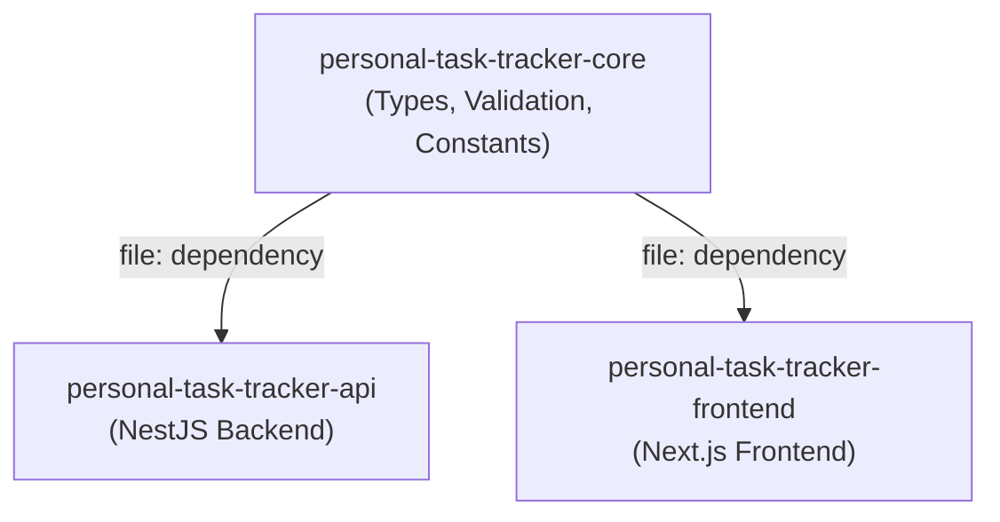

# Personal Task Tracker - Core

Shared TypeScript package containing types, enums, validation logic, and constants used by both the API and Frontend.

## How It Fits



Both API and Frontend consume this package via `"file:../personal-task-tracker-core"` in their `package.json`. During Docker builds, the core is copied into the build context and the symlink is replaced with a real copy.

## Installation

```bash
# From sibling repo (local development)
npm install personal-task-tracker-core@file:../personal-task-tracker-core
```

## Usage

```typescript
import {
  Task,
  TaskStatus,
  CreateTaskDTO,
  UpdateTaskDTO,
  validateCreateTask,
  validateUpdateTask,
  isValidTaskStatus,
  API_ROUTES,
  TASK_TITLE_MAX_LENGTH,
} from 'personal-task-tracker-core';
```

## Exports

### Types & Interfaces
- `Task` — Task model interface
- `CreateTaskDTO` — DTO for creating tasks
- `UpdateTaskDTO` — DTO for updating tasks
- `TaskFilterParams` — Query params for filtering
- `ApiResponse<T>` — Standard API success response
- `ApiErrorResponse` — Standard API error response

### Enums
- `TaskStatus` — `TODO | IN_PROGRESS | DONE`

### Constants
- `API_ROUTES` — API endpoint paths
- `TASK_TITLE_MIN_LENGTH` / `TASK_TITLE_MAX_LENGTH`
- `TASK_DESCRIPTION_MAX_LENGTH`

### Validation
- `validateCreateTask(dto)` — Validates create task input
- `validateUpdateTask(dto)` — Validates update task input
- `isValidTaskStatus(status)` — Type guard for TaskStatus

## Build

```bash
npm install
npm run build
```
